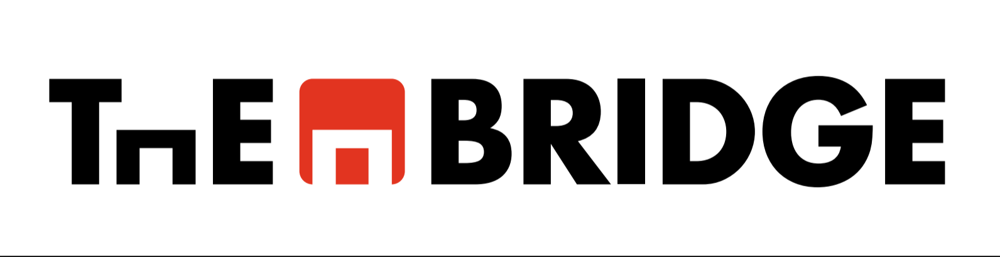

# Bootcamp - Data Science - Enero 2022 - The Bridge

----------

### **Foldername**: sql_thebridge

***Repository link:*** https://github.com/MNievas12/sql_thebridge

*To git clone by https:*

"git clone https://github.com/MNievas12/sql_thebridge"

- https://developers.google.com/machine-learning/glossary

---------

*Remember, you have many cheatsheets. Learn to use it.*

*PythonTutor is your friend... take care of it.*

*Use Google everytime you need. Google must be your shadow.*

---------

**Teacher Assistant**: *Alejandro Medina Santano*

- alejandro.medina@thebridgeschool.es

**Teacher Assistant**: *Marta Gómez Jiménez*

- marta.gomez@thebridgeschool.es

**Teacher Assistant**: *Juan Alejandro Maniglia*

- juan.maniglia@thebridgeschool.es

**Lead Instructor**: *Miguel Ángel Nievas Fuertes*

- miguel.nievas@thebridgeschool.es